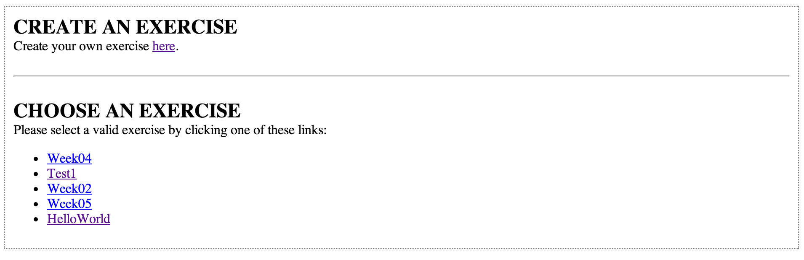
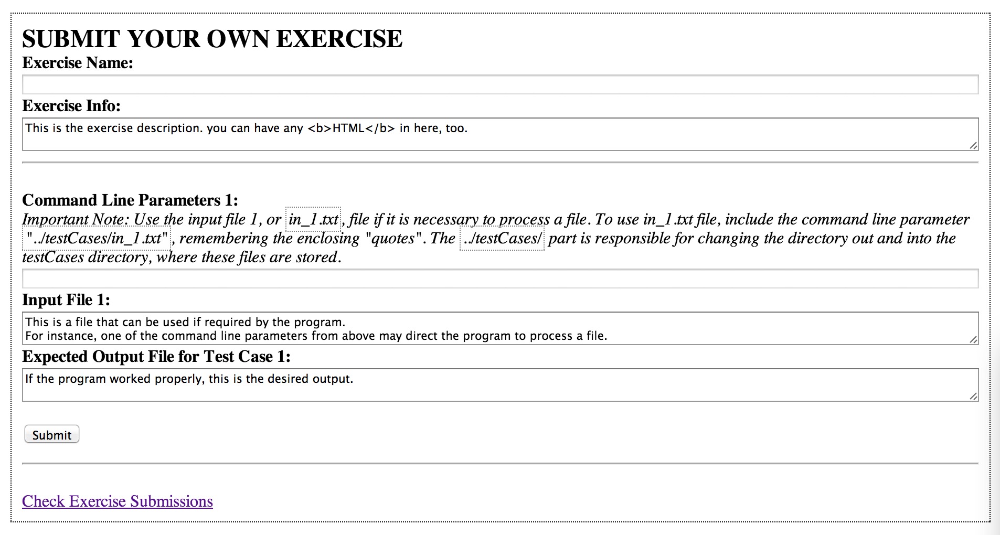
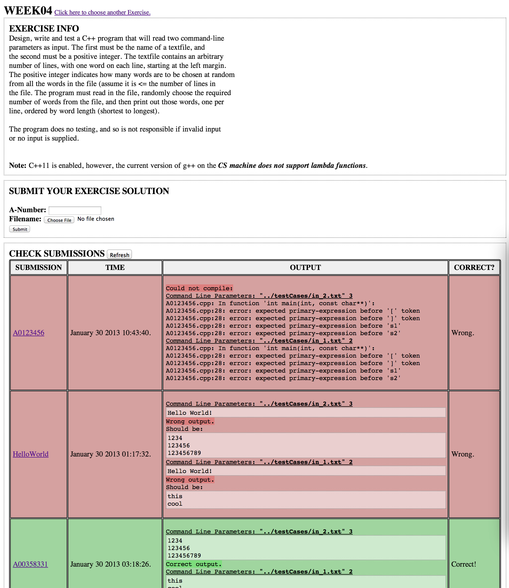

Code-Workout
============

> Solve programming exercises and submit them for validation.

Professors can now provide programming exercises to their student on this web app, 
and allow them to submit their solutions for testing.

Built by Glavin Wiechert for [Dr. Porter Scobey](http://cs.smu.ca/~porter/) and his Web Technologies course.

## Demo
See http://cs.smu.ca/~g_wiechert/Scobey2.0/exercise.php for live demo.

## Screenshots
### Create Exercise

### Submit Exercise

### View Exercise

